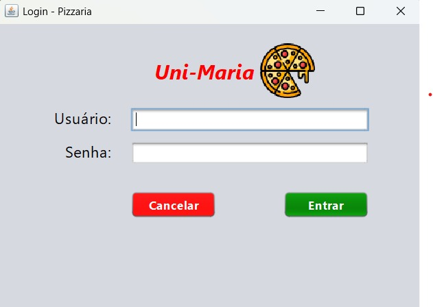
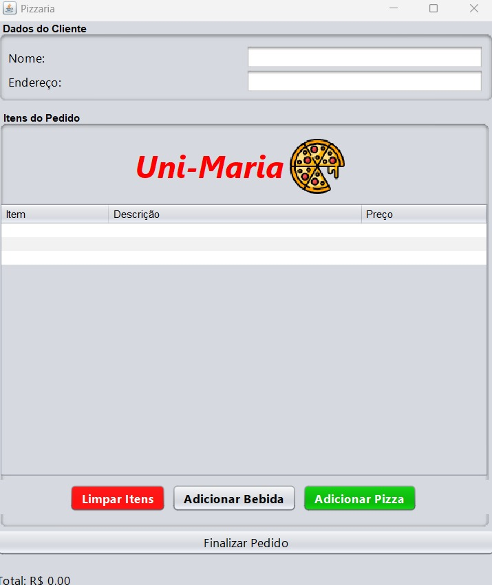
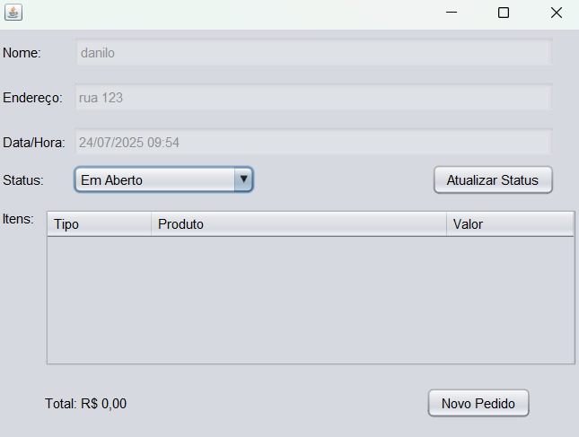

# 🍕 Projeto de Pizzaria

Projeto desenvolvido em Java utilizando a IDE NetBeans.  
Sistema automatizado para gerenciar pedidos e clientes de uma pizzaria.

## Funcionalidades

- Cadastro de clientes
- Registro e acompanhamento de pedidos
- Emissão de relatórios simples

## Tecnologias utilizadas

- Java
- NetBeans IDE

## Como usar

Abra o projeto no NetBeans e execute a aplicação.

Na primeira tela de login, utilize as seguintes credenciais:
- **Usuário:** Admin
- **Senha:** admin123

Na segunda tela, insira as informações do cliente: nome e endereço.  
Depois, adicione a quantidade de pizzas, seus sabores e tamanhos, e se desejar, adicione bebidas como acompanhamento.  
Por fim, clique no botão **"Finalizar Pedido"**.

Após isso, será exibida a última tela, onde você poderá visualizar o status de todos os pedidos realizados.
## 🖼️ Prints do Projeto

### Tela de Login

### Cadastro de Pedido

### Lista de Pedidos

---

Desenvolvido por **Danilo Malheiro**
🔗 [LinkedIn](www.linkedin.com/in/danilomalheiro)
